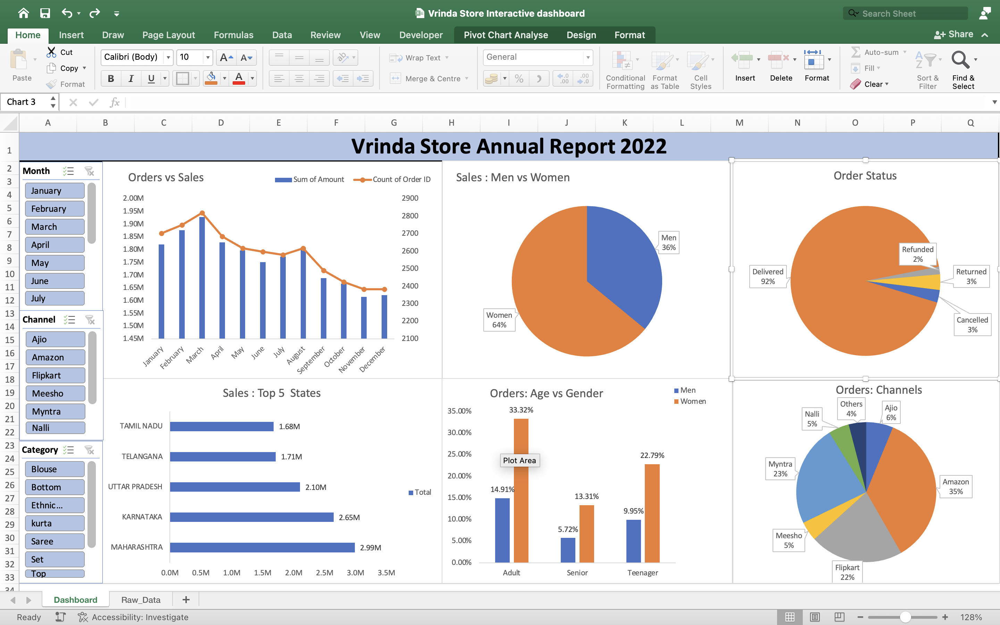

📊 Excel Sales Dashboard

🔍 Overview

This project is an interactive Excel dashboard created to analyze sales performance of a retail store.
It provides insights into sales trends, customer behavior, and channel performance to support data-driven decision-making.

📌 Key Features

* Dynamic and interactive dashboard
* Sales vs Orders trend analysis
* Sales distribution by gender
* Order status breakdown
* Top performing states
* Channel-wise sales analysis
* Age group insights

🛠 Tools Used

* Microsoft Excel
* Pivot Tables
* Charts (Bar, Line, Pie)
* Slicers & Filters

📷 Dashboard Preview

📁 Files Included

* Vrinda_Store_Dashboard.xlsx
* dashboard.png

📈 Key Insights

* Women contribute approximately 64% of total sales, indicating a higher purchasing trend compared to men.
* The Adult age group generates the highest number of orders, followed by Teenagers.
* Amazon and Myntra are the top-performing sales channels.
* Maharashtra, Karnataka, and Uttar Pradesh are among the top states in terms of sales.
* The majority of orders are successfully delivered (~92%), with very low cancellation and return rates.
* Sales show a declining trend towards the end of the year, indicating possible seasonality.

📊 Conclusion

The dashboard highlights that sales are primarily driven by female customers and adult age groups.
Top-performing channels like Amazon and Myntra contribute significantly to revenue, while most orders are successfully fulfilled.
These insights can help businesses optimize marketing strategies and inventory planning.

🚀 Project Purpose

This project demonstrates my skills in Excel, data cleaning, data analysis, and dashboard creation.

🔗 GitHub Repository

https://github.com/prince17900/excel-sales-dashboard
